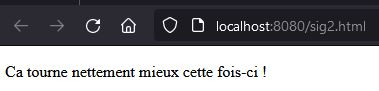

# SIG 2 - Evaluation pratique 2024 - Docker

## Enoncé

Lors de cette épreuve, nous allons valider les compétences suivantes:

* commande de base du client Docker
* écriture simple d'un fichier docker
* construction (build) et lancement (run) d'un contener
* redirection de port (port forwarding) entre votre conteneur et votre environnement local.

## Moyens à disposition

| Critère    | Valeur |
| -------- | ------- |
| Accès internet | oui |
| Travail collaboratif | non |
---

### Situation de départ

* [Le travail prépartoire a été réalisé](./001_travail_preparatoire.md).
* Le contenu html suivant vous est livré:

```html
<!--sig2.html-->
<!DOCTYPE html>
<html>
    <head>
        <title>Test SIG 2 2024</title>
    </head>
    <body>
        <p>Ca tourne nettement mieux cette fois-ci !</p>
    </body>
</html> 
```

* Le répertoire dédié à Apache pour afficher du contenu html est le suivant:
```bash
/usr/local/apache2/htdocs
```

* Docker file de départ
```
FROM httpd:alpine
```

### Situation attendue

* Une fois le conteneur déployé, vous devez pouvoir afficher cette page html :
---



---

#### Critères d'évaluation

| Critère    | Valeur | Pondération |
| -------- | ------- | --- |
| Docker file | Permet de construire une image | 1pt |
| Docker file | Ne contient que le strict minimum | 1pt |
| Docker file | Bonnes pratiques d'écriture | 1pt |
| Tag de l'image | sig2-web-site     | 1pt |
| Conteneur | N'expose que le ou les ports nécessaires  | 1pt |
| Hôte | Apache est exposé sur le port local 8080 de votre machine | 1pt |
| Hôte | La page Nginx d'accueil s'affiche | 1pt |
| Hôte | Le site html sig.html s'affiche  | 1pt |

### Livrable

Les livrables doivent être intégrés (contenu de fichiers et commandes) dans le fichier [003_feuille_reponse](./003_feuille_reponse.md).

*** fin du document ***
